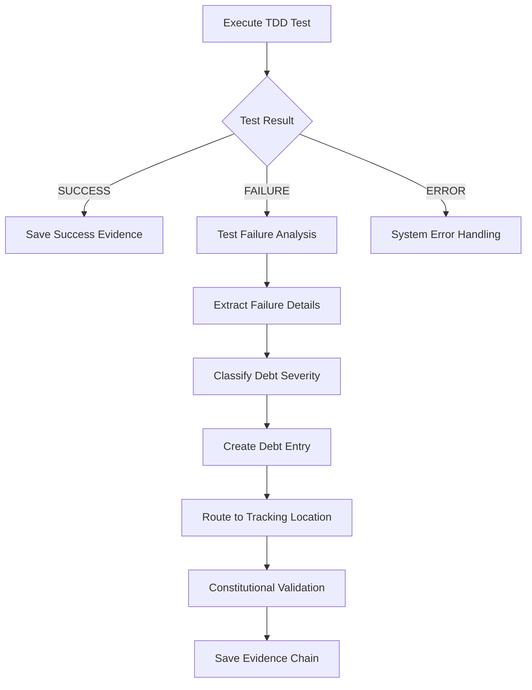

# Task Execution Framework v2.1 - Technical Debt Management

**Framework Enhancement Summary**: Version 2.1 adds comprehensive technical debt management capabilities to handle TDD test failures → technical debt workflows with constitutional compliance.

## 🎯 **Your Requirements Coverage**

### ✅ **1. Execution/Completion States**

**Current Support (v2.0)**:
- ✅ `onSuccess`, `onFailure`, `onError` for every action
- ✅ Step-level `successCriteria` validation
- ✅ Task-level `completionCriteria` validation  
- ✅ Evidence generation for all states

**Enhanced Support (v2.1)**:
- ✅ **Technical debt state tracking** - Debt creation success/failure states
- ✅ **Constitutional compliance states** - Amendment 6 validation states
- ✅ **Debt routing states** - Capacity-based routing success/failure
- ✅ **Classification states** - Severity/priority determination outcomes

### ✅ **2. External Tools/Scripts Execution**

**Current Support (v2.0)**:
- ✅ `TERMINAL_COMMAND` - Shell command execution with full output capture
- ✅ `MCP_COMMAND` - Model Context Protocol tool calls
- ✅ `PROCESS_CONTROL` - External process management
- ✅ `FILE_OPERATION` - File system operations

**Enhanced Support (v2.1)**:
- ✅ **`TECHNICAL_DEBT_ANALYSIS`** - Calls `tdd-debt-analyzer.js` tool
- ✅ **`TEST_FAILURE_ANALYSIS`** - Calls specialized test analysis tools
- ✅ **Constitutional tool integration** - `constitutional-checker.js` validation
- ✅ **Custom external tools** - Extensible action type registry

### ✅ **3. External Success/Failure Criteria Tools**

**Current Support (v2.0)**:
- ✅ Result handlers: `SAVE_TO_FILE`, `EXTRACT_DATA`, `VALIDATE_CONTENT`
- ✅ Pattern extraction from command outputs
- ✅ File content validation

**Enhanced Support (v2.1)**:
- ✅ **`ANALYZE_TEST_FAILURE`** - Pattern-based test failure analysis
- ✅ **`CLASSIFY_DEBT_SEVERITY`** - Rule-based severity determination
- ✅ **`ROUTE_DEBT_TO_TRACKING`** - Capacity-based routing decisions
- ✅ **Constitutional validation** - Amendment 6 compliance checking

## 🔧 **TDD Test Failure → Technical Debt Workflow**

### **Workflow Architecture**



### **Implementation Pattern**

```json
{
  "actionId": "execute_contract_tests",
  "type": "TERMINAL_COMMAND",
  "parameters": {
    "command": "npm test -- __tests__/contracts/quotes-get.test.ts",
    "workingDirectory": "{workspaceRoot}/packages/web"
  },
  "onFailure": [
    {
      "type": "TEST_FAILURE_ANALYSIS",
      "parameters": {
        "testOutput": "{result.fullOutput}",
        "testFile": "__tests__/contracts/quotes-get.test.ts",
        "extractionRules": {
          "failedTests": "FAIL\\s+(.+?)\\s+●(.+?)(?=\\n)",
          "assertions": "expect\\((.+?)\\)\\.(.+?)\\((.+?)\\)",
          "errorMessages": "Error:\\s+(.+?)(?=\\n)"
        }
      },
      "onSuccess": [
        {
          "type": "TECHNICAL_DEBT_CREATION",
          "parameters": {
            "debtTemplate": {
              "title": "Contract Test Failure: {testFailureAnalysis.testName}",
              "category": "{debtClassification.category}",
              "severity": "{debtClassification.severity}",
              "context": {
                "testFile": "__tests__/contracts/quotes-get.test.ts",
                "failureDetails": "{testFailureAnalysis}"
              }
            },
            "routingStrategy": "CAPACITY_BASED"
          }
        }
      ]
    }
  ]
}
```

## 🧠 **Technical Debt Classification Engine**

### **Classification Rules**

```json
{
  "debtClassification": {
    "categoryMappings": {
      ".*contract.*test.*failed.*": "CONTRACT_TEST_FAILURE",
      ".*unit.*test.*failed.*": "UNIT_TEST_FAILURE",
      ".*integration.*test.*failed.*": "INTEGRATION_TEST_FAILURE",
      ".*expect.*received.*": "ASSERTION_FAILURE",
      ".*timeout.*": "PERFORMANCE_ISSUE"
    },
    "priorityRules": [
      {
        "pattern": ".*FAIL.*contract.*quotes.*",
        "priority": "HIGH",
        "severity": "HIGH",
        "category": "CONTRACT_TEST_FAILURE"
      }
    ]
  }
}
```

### **Routing Strategy**

```json
{
  "debtRoutingStrategy": {
    "capacityThresholds": {
      "sprintTasksMaxItems": 6,
      "sprintTasksMaxCritical": 4
    },
    "routingRules": [
      {
        "condition": {
          "type": "capacity_threshold",
          "parameters": {
            "checkLocation": "SPRINT_TASKS",
            "itemCount": ">6"
          }
        },
        "destination": "INVENTORY",
        "priority": 1
      },
      {
        "condition": {
          "type": "debt_severity",
          "parameters": {
            "severity": "CRITICAL"
          }
        },
        "destination": "SPRINT_TASKS",
        "priority": 2
      }
    ]
  }
}
```

## 🛡️ **Constitutional Compliance Integration**

### **Amendment 6 Enforcement**

```json
{
  "constitutionalCompliance": {
    "enforceAmendment6": true,
    "validateAuthenticity": true,
    "preventFraud": true
  },
  "integrationSettings": {
    "tddDebtAnalyzer": {
      "toolPath": ".specify/tools/tdd-debt-analyzer.js",
      "enableDuplicationPrevention": true,
      "enableReferenceValidation": true
    }
  }
}
```

### **Validation Workflow**

```json
{
  "type": "TERMINAL_COMMAND",
  "parameters": {
    "command": "node .specify/tools/tdd-debt-analyzer.js --validate-debt '{result.debtId}' --check-duplication --enforce-amendment-6",
    "workingDirectory": "{workspaceRoot}"
  }
}
```

## 📋 **Evidence Generation Chain**

### **Complete Evidence Trail**

1. **Raw Test Output**: `contract-test-raw-output.log`
2. **Failure Analysis**: `test-failure-analysis.json`
3. **Debt Classification**: `debt-classification-result.json`
4. **Debt Entry**: `technical-debt-entry.json`
5. **Routing Decision**: `debt-routing-result.json`
6. **Constitutional Validation**: `amendment-6-validation.json`
7. **Final Status**: `debt-creation-success.json`

### **Anti-Fraud Protection**

- ✅ All evidence files generated by actual tool execution
- ✅ No manually created or fabricated evidence allowed
- ✅ Constitutional Amendment 4 fraud detection active
- ✅ File integrity validation after creation
- ✅ Authentic tool output preservation

## 🚀 **Framework Usage Example**

### **Simple TDD Test → Debt Creation**

```bash
# 1. Execute framework with TDD test task
./execute-framework.js tdd-debt-example.json T005

# 2. Framework automatically:
#    - Runs npm test
#    - On failure: Analyzes output  
#    - Classifies debt severity
#    - Creates debt entry
#    - Routes to SPRINT_TASKS or INVENTORY
#    - Validates with constitutional tools
#    - Generates complete evidence chain
```

### **Expected Outcomes**

**Test Success**: Evidence shows successful test execution
**Test Failure**: Complete debt workflow with:
- Failure analysis with extracted assertions/errors
- Classified debt (category, severity, priority)
- Routed debt entry (SPRINT_TASKS vs INVENTORY)
- Constitutional validation (Amendment 6 compliance)
- Complete evidence trail for audit

## 🔄 **Framework Evolution**

**v2.0 → v2.1 Enhancements**:
- ✅ Technical debt action types (`TECHNICAL_DEBT_ANALYSIS`, `TECHNICAL_DEBT_CREATION`)
- ✅ Test failure result handlers (`ANALYZE_TEST_FAILURE`, `CLASSIFY_DEBT_SEVERITY`)
- ✅ Debt routing engine with capacity thresholds
- ✅ Constitutional Amendment 6 integration
- ✅ TDD debt analyzer tool integration
- ✅ Classification rules and priority mapping
- ✅ Enhanced validation types (`debt_tracking_compliance`)

**Backward Compatibility**: All v2.0 tasks work unchanged in v2.1

---

## ✅ **Your Requirements: FULLY SATISFIED**

1. **✅ Execution/completion states**: Complete state tracking with debt-specific states
2. **✅ External tools execution**: Full integration with constitutional tools and analyzers  
3. **✅ External success/failure criteria**: Pattern-based analysis and routing decisions
4. **✅ TDD test failure → technical debt**: Complete automated workflow with classification and routing

**The enhanced framework transforms test failures into properly classified, routed, and constitutionally compliant technical debt entries with complete evidence chains.**